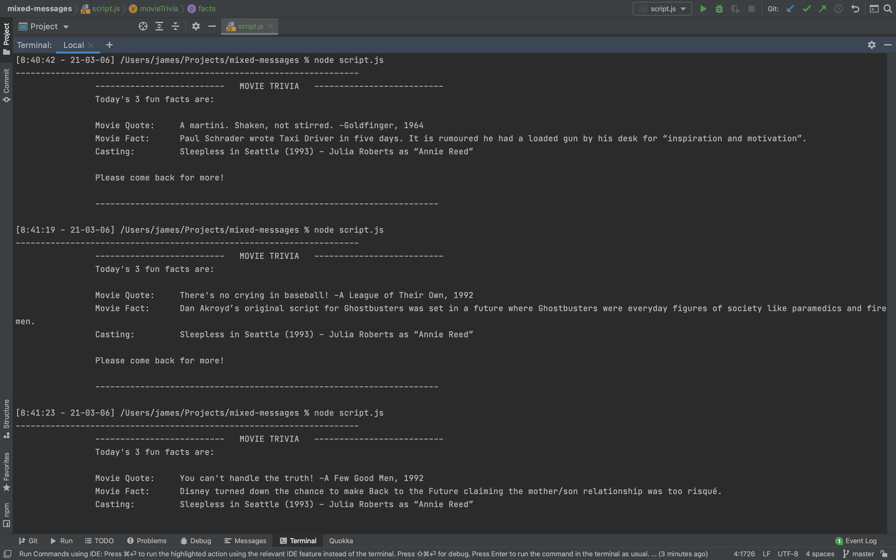

# Mixed Messages
> This project is a Movie Trivia generator program. 
> Every time a user runs the program, they should get a randomized output. 
> The message output is made up of at least three different pieces of data.

## Table of contents
* [General info](#general-info)
* [Screenshots](#screenshots)
* [Technologies](#technologies)
* [Setup](#setup)
* [Features](#features)
* [Status](#status)
* [Contact](#contact)

## General info
The objective of this project is to build a Movie Trivia generator program using: 

* JavaScript
* Git version control 
* Command line
* Develop locally using an IDE (WebStorm)

## Screenshots

## Technologies
* Javascript 
* Node.js - v.7.5.4

## Setup

Prerequisites:
* Node.js - v.7.5.4

Steps to Execute:
1. Open terminal 
2. Change to project directory
3. To run enter `node script.js`

## Features

Random Movie Trivia Generator that returns:

* Movie Quotes
* Movie Facts
* Movie Casting

## Status
Project is: Complete

## Contact
Created by James Brett